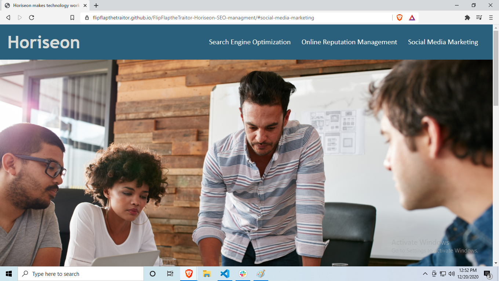

Horiseon project
## Active link
Active link for the site can be found here https://flipflapthetraitor.github.io/FlipFlaptheTraitor-Horiseon-SEO-managment/#social-media-marketing
## Prerequisites 
This site requires nothing but a web browser to run and any text editor to edit the application.
## Installation
The goal of this project was to take Horiseons already existing page and make it more accesible.
 Along with making it more accessible the goal was to make sure the HTML and CSS elements followed logical structure.
 I also made sure that structures where independent from each other. 
 While making sure to add alts to discribe images and also make sure the CSS code was as effeicent as possible.
## Usage
This site is a single page site used by Horiseon a SEO managment company. The goal of this site is to convince potential clients to procure Horiseons services in order to increase their web traffic in a positive manner thus growing the clients business.
  
